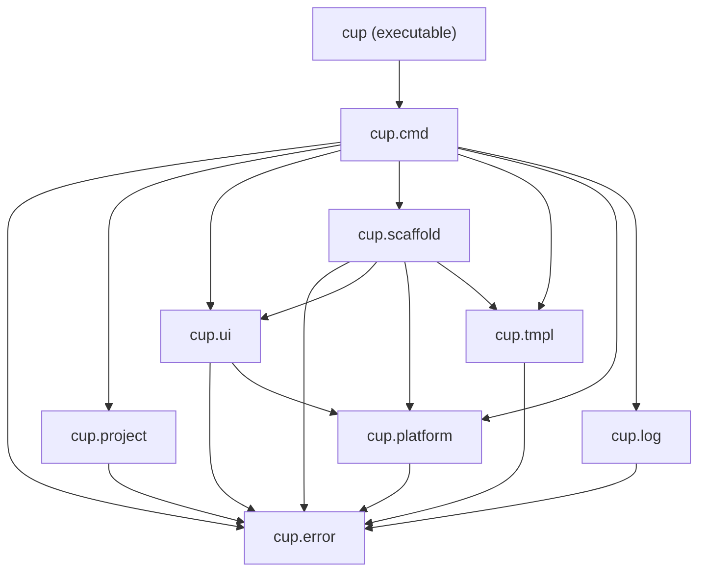
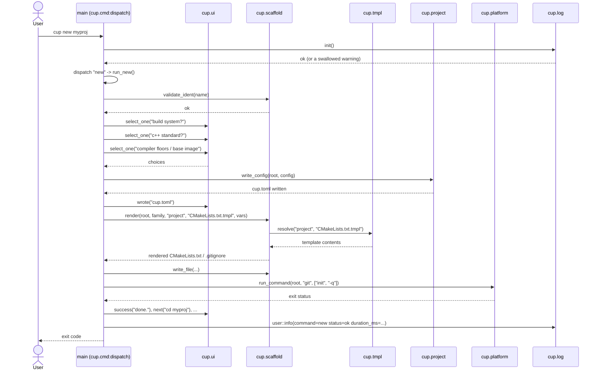

# cup

[](https://github.com/DrHurel/cup/actions/workflows/ci.yml)
[](https://sonarcloud.io/summary/new_code?id=DrHurel_cup)
[](https://sonarcloud.io/summary/new_code?id=DrHurel_cup)
[](https://sonarcloud.io/summary/new_code?id=DrHurel_cup)
[](https://sonarcloud.io/summary/new_code?id=DrHurel_cup)
[](https://sonarcloud.io/summary/new_code?id=DrHurel_cup)
[](https://sonarcloud.io/summary/new_code?id=DrHurel_cup)
[](https://sonarcloud.io/summary/new_code?id=DrHurel_cup)
[](https://sonarcloud.io/summary/new_code?id=DrHurel_cup)
[](https://sonarcloud.io/summary/new_code?id=DrHurel_cup)
[](https://sonarcloud.io/summary/new_code?id=DrHurel_cup)
[](https://sonarcloud.io/summary/new_code?id=DrHurel_cup)


`cup` scaffolds and manages C++ projects from a single binary — itself written
in C++23. Pick a standard when you create a project and `cup` scaffolds to
match it: **C++20/23**
projects are built from C++ modules (`import std;` on C++23 unless you opt out —
see [Toolchain requirements](#toolchain-requirements)), while
**C++11/14/17** projects use classic headers. Either way the projects it creates
are *thin* — just source, a build file, and a `cup.toml` marker. All build and
scaffolding logic lives in `cup` itself, so one installed binary manages every
project.

## Build systems

`cup new` asks which build system to scaffold, recorded as `build_tool` in
`cup.toml`:

- **`cmake`** (default) — drives every standard, C++11 through C++23 (headers or
  modules). `cup add` registers each component with `add_subdirectory(...)` in a
  parent `CMakeLists.txt`.
- **`make`** — for the many projects still built with Makefiles. Make cannot
  robustly build C++20/23 modules, so it is offered only for the **headers
  family (C++11/14/17)**. The generated root `Makefile` **discovers** components
  by path (every `.cpp` under `src/libs` becomes an archive; each `src/apps/*`
  and `src/tests/*.cpp` a binary) and generates all its rules from that list.

Because the Make backend discovers components instead of listing them, `cup add`
writes **only files inside the new component's own directory** — it never edits
the root `Makefile`. Adding components on different branches therefore produces
no rebase/merge conflicts in a shared build file. Objects land under
`build/<mode>/obj`, archives under `build/<mode>/lib`, and binaries under
`build/<mode>/bin` — the same `build/<mode>` layout as the CMake backend, so
`cup build|run|test|clean [Debug|Release|Coverage]` work identically either way.

## Supported platforms

- **Precompiled binary** (musl-static, x86-64): works on any Linux distro —
  static linking means no libc/version to match, glibc or musl alike.
- **Building from source**: CI-verified on **Ubuntu 24.04** (the GCC 15
  floor, plus a non-blocking GCC 16 canary), **Fedora 42**, and **Debian
  (sid)** — one job each in `.github/workflows/`, so "supports Fedora" is a
  real CI run, not untested prose. Any distro shipping GCC 15+ / CMake 3.28+
  / Ninja should work the same way even if it isn't in that CI matrix.
- **Architecture**: x86-64 only, precompiled or from source. No ARM64 build
  yet.

## Install

Most people never need a compiler at all — three ways to get a build, all
produced by the same CI (see `.github/workflows/cpp.yml`) and attached to
every [tagged release](https://github.com/DrHurel/cup/releases/latest):

**musl-static binary** (any Linux, x86-64):

```sh
cp cup-linux-x86_64-musl ~/.local/bin/cup
chmod +x ~/.local/bin/cup      # any dir on PATH works
cup completion install         # detects your shell and wires it in (optional)
```

**`.deb` package** (Debian/Ubuntu — apt manages install/upgrade/removal):

```sh
sudo apt install ./cup_*.deb
cup completion install         # optional
```

Every push also builds both as CI artifacts (the `alpine musl-static` and
`build .deb` jobs), for testing a specific commit ahead of a tagged release.

### Building from source

Needs **GCC 15+** (named modules) and **CMake 3.28+** with **Ninja** (CMake's
Makefile generator has no dyndep support for modules — see [Toolchain
requirements](#toolchain-requirements)). Ubuntu 24.04's own archive tops out
at `g++-13`; add the toolchain PPA first, or use an OS that already ships
GCC 15+ (Fedora 42+, any rolling release):

```sh
sudo add-apt-repository -y ppa:ubuntu-toolchain-r/test
sudo apt-get update && sudo apt-get install -y g++-15 ninja-build cmake libcurl4-openssl-dev

./devtools/install.sh          # bootstrap-builds build/cup, then copies it
                                # onto PATH (~/.local/bin by default)
```

The bootstrap build is plain `cmake`/`ninja` because there is no `cup` yet to
build itself. From then on `build/cup build` drives the same cmake/ninja
invocation through cup's own config — see [Devtools
scripts](#devtools-scripts) and `docs/migration-cpp23.md`'s Phase 5.

A portable build environment (GCC 15 + CMake + Ninja, no local toolchain
install needed) is available via Docker:

```sh
./devtools/docker-build.sh
docker run --rm -v "$PWD:/work" cup-dev ./devtools/build.sh
```

## Devtools scripts

- `./devtools/build.sh` — bootstrap-build `cup` (plain cmake/ninja) into `build/cup`
- `./devtools/test.sh` — configure, build, and run the Catch2 suite via ctest
- `./devtools/install.sh [dest]` — build.sh, then copy the result onto PATH
  (default `~/.local/bin`) as `cup`
- `./devtools/clean.sh` — remove `build/`
- `./devtools/docker-build.sh` — build the `cup-dev` utility image

## Docker build images

cup manages a project's build images under `docker/<image-name>/Dockerfile`, one
directory per image, tracked in the `[docker]` table of `cup.toml`. `cup new`
creates a **default build image** and asks for its base image, offering the tags
of whatever Docker Hub repository you name (e.g. `gcc`, `debian`, `silkeh/clang`).

The default image **updates itself**: when you register or remove an apt
third-party dependency, cup regenerates its Dockerfile to install the matching
system packages on top of the base. `cup compiler verify` builds and compiles the
project in this image, so the verify toolchain always matches the third parties
the project declares.

Images are **versioned by content**. `cup docker build` hashes the Dockerfile and
increments the image's version only when it changed since the last build, tagging
`<name>:<version>` (and `<name>:latest`). `cup docker push` publishes to the
registry stored in `[docker].registry` (prompted and saved on first push):

```sh
cup docker new              # add another image (e.g. a runtime/CI image)
cup docker build            # build all images; bumps versions on change
cup docker push             # tag <registry>/<name>:<version> and push
```

The generated default Dockerfile is a normal project artifact — commit it (and
`cup.toml`) so builds are reproducible for everyone.

## Commands

```
cup new [name]                     create a new C++ project (prompts for name + standard)
cup add [app|lib|test]             scaffold a target (interactive if no arg)
cup configure [MODE]               generate the CMake build system
cup build [MODE]                   configure + compile
cup rebuild [MODE]                 wipe build/ then compile
cup run [MODE] [app] [-- args]     build then run an app
cup test [MODE]                    build then run the test suite (ctest)
cup retest [MODE]                  wipe build/ then run the test suite
cup clean                          remove the build/ directory
cup compiler                       show the project's minimum compiler versions
cup compiler set <gcc|clang> <v>   change a floor (docker-verified before commit)
cup compiler verify                compile the project in the build image
cup docker new                     scaffold a new build image (prompts name + base)
cup docker build [name]            build image(s); bumps the version on a change
cup docker push [name]             push image(s) to the configured registry
cup register                       register a third-party dependency
cup unregister [name]              remove a third-party dependency
cup template list                  list library-component templates
cup template new [name]            add a project-local template
cup completion <install|bash|zsh|fish>  install or print shell completion
cup --version, -v                  print cup's version (and build SHA, for a GitHub-built binary)
```

`MODE` is `Debug` (default), `Release`, or `Coverage`; each gets its own
`build/<MODE>` tree.

## Layout of a created project

```
myproj/
  cup.toml                 project marker (name, cup version, cpp_standard, std_module, [compiler])
  CMakeLists.txt           per-mode build tree, coverage; import std on C++23
  .gitignore
  src/apps/<name>/         executables (one file per app dir)
  src/libs/<name>/         libraries — C++ modules or classic headers per standard
  src/tests/               ctest executables
  third_party/             dependencies (created by cup register)
  .cup/templates/<kind>/   optional project-local template overrides / additions
```

Libraries scaffold differently per standard. On C++20/23 a lib is a module: a
primary interface (`<name>.cppm`) re-exports partition files (one per symbol). On
C++11/14/17 a lib is a header/source pair driven by a `<name>.hpp` aggregator.

## Module diagram

`cup` itself is organized as a layered set of C++20 modules. Each box is a
primary module interface under `src/libs/cup/*`; arrows point from a module to
the modules it imports.



| Module | Partitions | Purpose |
| --- | --- | --- |
| `cup.error` | `:error`, `:monad` | Error type and monadic `Result`/`Expected`-style helpers used everywhere else. |
| `cup.log` | `:log` | Structured logging (`cup.log`) backed by spdlog. |
| `cup.platform` | `:terminal`, `:net`, `:process` | OS-facing primitives: terminal I/O, HTTP, and subprocess execution. |
| `cup.project` | `:config`, `:io` | Reads/writes a project's `cup.toml` and derives on-disk paths from it. |
| `cup.tmpl` | `:corpus`, `:resolve` | Built-in template corpus and template-path resolution for `cup add`/`cup template`. |
| `cup.ui` | `:io`, `:color`, `:prompt`, `:select` | Terminal UI toolkit: colored output, prompts, and interactive selection. |
| `cup.scaffold` | `:naming`, `:std`, `:render`, `:cmake`, `:compiler`, `:releases`, `:dockerhub` | Generates project/component files — naming conventions, CMake, Dockerfiles, compiler/toolchain setup, and GitHub release lookups. |
| `cup.cmd` | `:build`, `:docker`, `:new_project`, `:add`, `:template_cmd`, `:completion`, `:compiler`, `:thirdparty`, `:dispatch` | One partition per CLI subcommand (`cup build`, `cup new`, `cup add`, ...), plus `:dispatch` which routes parsed arguments to them. |

### Runtime flow: `cup new`

Every invocation follows the same shape: `main` hands the raw args to
`cup.cmd`, which logs, dispatches to a subcommand partition, and calls back
into the lower-level modules to do the actual work. `cup new` is the most
representative example since it touches nearly every module in one run:



## Templates

`cup` ships built-in templates for the component kinds `class`, `interface`,
`enum`, `free-function`, and `templated-class`, plus `app` and `test` — in two
families, `modules` and `headers`, chosen automatically from the project's
standard. A project can add its own kind — or override a built-in — by dropping a
directory of the same shape into `.cup/templates/<kind>/`; `cup template new`
copies a built-in there to start from. A modules library kind needs a
`source.cppm.tmpl` and a `CMakeLists.txt.tmpl`; a headers kind uses
`source.h.tmpl` + `source.cpp.tmpl`. Placeholders use `{{name}}` syntax (`name`,
`filename`, `module`, `symbol`, `namespace`, `module_import`).

## Toolchain requirements

Requirements scale with the standard you pick:

- **C++23** (`import std;`) needs **CMake ≥ 3.30** and a compiler shipping the
  std-module manifest (**GCC 15+**). CMake's `import std` support is gated
  behind a version-specific UUID (`CMAKE_EXPERIMENTAL_CXX_IMPORT_STD`) that it
  rotates almost every release and exposes no way to query; `cup configure`/
  `cup build` detects the installed CMake and supplies the matching value
  itself, so the committed `CMakeLists.txt` doesn't go stale against whichever
  CMake actually builds it. A CMake release outside cup's known table (see
  `import_std_gate_uuid` in `src/libs/cup/cmd/Build.cpp`) fails with a clear
  error instead of CMake's cryptic `CXX_MODULE_STD` one.
- **C++20** named modules need **CMake ≥ 3.28**.
- **C++11/14/17** have no special requirements beyond a conforming compiler.

Named modules and `import std;` are separate capabilities, so C++23 does not have
to cost you GCC 15: setting

```toml
cpp_standard = 23
std_module = false
```

in `cup.toml` keeps the **CMake 3.28 / GCC 14** requirements of C++20 modules while
`cup add` scaffolds C++23 sources — a `module;` + `#include <print>` global module
fragment instead of `import std;`, with `std::println` and `std::expected`
available as ordinary standard-library features. Leave `std_module` out and the
standard decides (C++23 uses the std module, C++20 cannot). `cup new` has no
prompt for it yet, so set it by hand; cup's own `cup.toml` sets
`std_module = false` this way, though it separately pins a GCC 15 floor of its
own — an unrelated GCC 14 modules limitation, not a `std_module` requirement;
see `docs/migration-cpp23.md`'s Phase 4 note.

On an older toolchain `cup build` stops at CMake's version check — scaffolding
still works everywhere.

## Minimum compiler versions

A project can pin a **minimum GCC and/or Clang version** in the `[compiler]`
table of its `cup.toml`, and the generated root `CMakeLists.txt` enforces it: a
build with an older toolchain stops at a clear `FATAL_ERROR` instead of failing
deep in a compile. `cup new` first asks **which** compilers to pin — GCC, Clang,
or both — then, for each, the version. A compiler you don't pin is simply left
out of `cup.toml` and unenforced. The version picker offers the range from the
standard's baseline up to the newest released compiler:

- The **baseline** (lowest version that can build a standard — C++23 needs GCC
  15 for `import std;`) is a small curated map of stable language facts. It is
  only the *default*: a floor already pinned in `cup.toml` wins, so a C++23
  project with `std_module = false` can sit on GCC 14.
- The **ceiling** is discovered live from the GNU gcc release index and the LLVM
  GitHub releases, so the list never goes stale as new compilers ship. The
  result is cached (~/.cache/cup) for a week and falls back to a bundled default
  when offline, so project creation still works with no network.

When a compiler has a single valid version (e.g. GCC on C++23) it is chosen
without prompting.

```toml
[compiler]
gcc = 15
clang = 17
verify_image = "cup-cxx:latest"   # docker image cup builds in to verify a change
```

Change a floor with `cup compiler set`:

```sh
cup compiler                 # show the current floors and verify image
cup compiler set gcc 14      # lower the GCC floor to 14…
cup compiler verify          # …or just check the project still builds
```

A change is **docker-verified before it is committed**: cup writes the new floor
to `cup.toml` and the CMake guard, then compiles the project inside the project's
build image (source mounted read-only, build kept inside the container). If that
build fails, the change is **cancelled** — `cup.toml` and `CMakeLists.txt` are
restored byte-for-byte, so a floor can never claim more than what compiles.

The verify image is resolved in order: an explicit `--image REF`; the project's
**default build image** (see [Docker build images](#docker-build-images)), rebuilt
first so it carries the current apt dependencies; or a legacy `verify_image` in
`cup.toml`. Use `--no-verify` on `set` to skip the check when none is configured.

Because the default build image already installs the system packages of any
**apt-install** third party (a `find_package(...)` needs its package present at
build time), `cup compiler verify` tests against exactly the third parties the
project declares. Submodule and `cmake-download` dependencies build from source
inside the container and need no image changes.
